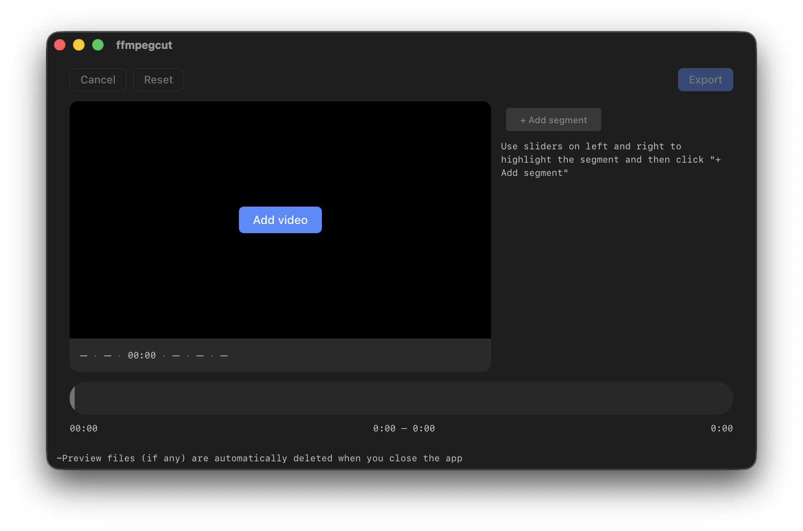
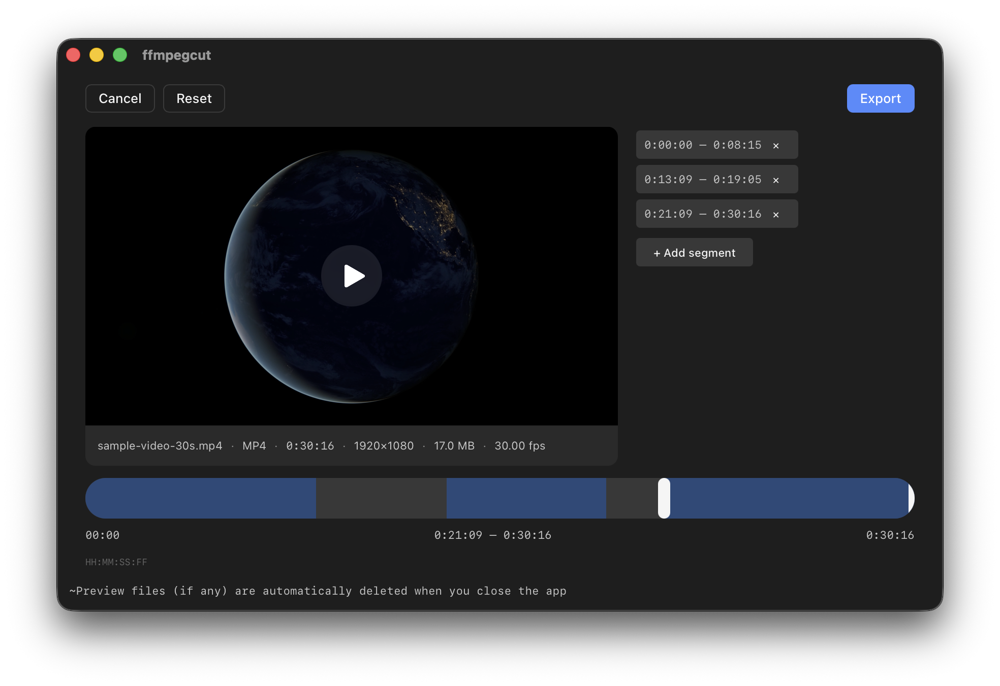

# ffmpegcut

A small cross-platform desktop app for cutting video clips fast. Powered by Tauri, Solid, and a bundled `ffmpeg` doing stream-copy cuts — no re-encoding.

## Preview





## Features

- Two-handle timeline to pick an in / out point, with frame-accurate snapping
- Multiple cuts in one pass — add as many segments as you want, export once
- Native open and save dialogs
- Stream-copy output (no quality loss, very fast)
- Single binary app on macOS and Windows

## Platform support

- **macOS**: Apple Silicon (aarch64) only. Intel Macs are not supported by the release builds.
- **Windows**: not wired up in CI yet, but buildable from source (see below).

## Requirements

To develop or build from source you need:

- **Node.js** + **bun** (package manager / script runner)
- **Rust** toolchain (stable) and the platform deps for [Tauri 2](https://tauri.app/start/prerequisites/)
- **macOS**: Xcode Command Line Tools
- **Windows**: Microsoft C++ Build Tools + WebView2 (already shipped on Windows 10/11)

`ffmpeg` and `ffprobe` are bundled as Tauri sidecar binaries under `src-tauri/binaries/` — you do not need to install them yourself.

## Run in development

```sh
bun install
bun run tauri dev
```

This starts Vite, launches the Tauri shell, and opens the app window with hot reload.

## Build a release bundle

### macOS (automated)

The aarch64 (Apple Silicon) `ffmpeg`/`ffprobe` sidecars ship committed in the repo under `src-tauri/binaries/` — no secrets or base64 encoding step needed. CI verifies them (`test -s` + `file … | grep arm64`) on both the source and bundled binaries before building.

1. Open the Actions tab → "release" workflow → "Run workflow".
2. Enter a tag (default `v0.1.0`) and click run.
3. The workflow builds an **aarch64-only** `.dmg` (Apple Silicon) and attaches it to a new GitHub Release. Intel Macs are not supported.

**⚠️ The released DMG is unsigned and will not run as downloaded.** macOS Gatekeeper blocks unsigned, unnotarized apps from launching, and right-click → Open will not bypass this for a fresh download from the internet. The CI-built DMG is provided for reference/distribution scaffolding only — to actually run the app, build it locally on your own machine (see below), which produces a binary macOS will let you open.

### Locally

```sh
bun run tauri build
```

Bundles land under `src-tauri/target/release/bundle/`. For a universal macOS build, add `--target universal-apple-darwin`.

For a frontend-only build (no native shell):

```sh
bun run build
```

### Windows

Not wired up in CI yet. To produce a Windows installer yourself:

1. Download `ffmpeg` and `ffprobe` Windows builds (e.g. from [BtbN/FFmpeg-Builds](https://github.com/BtbN/FFmpeg-Builds/releases) — pick `win64-gpl`).
2. Extract the two `.exe` files from the zip.
3. Rename and place them in `src-tauri/binaries/`:
   - `ffmpeg-x86_64-pc-windows-msvc.exe`
   - `ffprobe-x86_64-pc-windows-msvc.exe`
4. On Windows, run `bun run tauri build`. Installers land in `src-tauri/target/release/bundle/`.

Note: the app is unsigned. Windows SmartScreen will warn on first launch.

## How it works

1. Pick a video with the native file dialog.
2. Drag the two timeline handles (full-width below the preview) to set a range. Add it as a segment in the panel next to the preview; repeat for as many cuts as you want.
3. Click **Export** in the topbar, choose where to save, and `ffmpegcut` runs `ffmpeg` once with the `concat` demuxer — every segment is stitched in a single stream-copy pass.
4. Use **Reset** or **Cancel** in the topbar to clear the selection or unload the video.

## Tech stack


- [Tauri 2](https://tauri.app/) (Rust) — desktop shell, sidecar process
- [Solid 1.9](https://www.solidjs.com/) + TypeScript — reactive UI
- [Vite 6](https://vitejs.dev/) — dev server / bundler
- [bun](https://bun.sh/) — package manager
- [ffmpeg](https://ffmpeg.org/) / [ffprobe](https://ffmpeg.org/ffprobe.html) — bundled, used in stream-copy mode

## License

MIT licensed. See [LICENSE](./LICENSE). This covers ffmpegcut's own source code only, not the bundled sidecar binaries below.

## Credits

This project is not affiliated with the FFmpeg project. It bundles unmodified `ffmpeg` and `ffprobe` static binaries built by [osxexperts.net](https://www.osxexperts.net/) from [FFmpeg release/6.1](https://github.com/FFmpeg/FFmpeg/tree/release/6.1), compiled with `--enable-gpl` and GPL-licensed components (libx264, libx265). As a result, the bundled binaries are licensed under the **GPL v2 or later**, not LGPL — see [ffmpeg.org/legal.html](https://ffmpeg.org/legal.html) and the [GPL v2 text](https://www.gnu.org/licenses/old-licenses/gpl-2.0.html). Because `ffmpegcut` invokes these as separate sidecar processes rather than linking against them, the GPL does not extend to `ffmpegcut`'s own source. Anyone distributing the bundled binaries must still be able to provide, or point to, the corresponding FFmpeg source used to build them; the source tree above is that reference. FFmpeg is a trademark of Fabrice Bellard; see [ffmpeg.org](https://ffmpeg.org/) for upstream source, license texts, and attribution.
